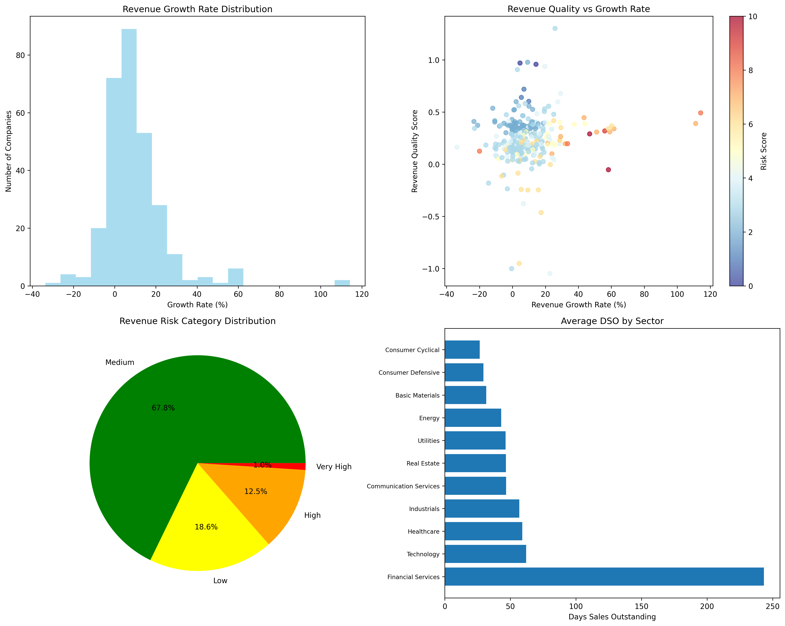

# 📊 FDA-3: Quantitative Analysis of Revenue Recognition Practices

> **Group 16 - BDA**  
> Detecting Aggressive Revenue Recognition Practices using Data Extraction & Machine Learning  

---

## 🚀 Project Overview

Revenue recognition is one of the most critical areas in financial reporting — and also one of the easiest to manipulate.  
In this project, we built a **data-driven system** to:

1. **Extract** revenue recognition policies from SEC 10-K filings  
2. **Link** them with quantitative financial metrics from Yahoo Finance  
3. **Analyze** revenue patterns for aggressive accounting practices  
4. **Visualize** company- and sector-level risks  

This repo contains the **pipeline, datasets, ML models, visualizations, and documentation** for our submission.

---

## 📂 Repository Structure

```

FDA3-RevenueRecognition/
├── datasets/             # Collected datasets (CSV)
│   ├── FDA3_Analytics_20250902.csv
│   ├── revenue_recognition_analysis.csv
│   └── mapping_to_url.csv
│
├── BTECH_16.ipynb/        # Jupyter Notebook
│   
│
├── docs/             # Project documentation PDFs
│   ├── FDA-3_Deliverable-01_Documentation.pdf
│   └── FDA-3_Deliverable-02_Documentation.pdf
│
├── visuals/          # Plots & dashboards
│   └── FDA3_Revenue_Analysis_20250902.png
│
│
├── requirements.txt  # Dependencies
└── README.md         # This file

````

---

## 🔑 Key Features

- ✅ **Data Acquisition**  
  - SEC EDGAR filings (`sec-edgar-downloader`)  
  - Yahoo Finance financial metrics (`yfinance`)  

- ✅ **Data Extraction**  
  - Regex + BeautifulSoup to isolate *Revenue Recognition* sections  
  - Cleaned, normalized, merged into CSV datasets  

- ✅ **Analytics & ML**  
  - **Text Classification (GPT)** → method, standard, pattern of recognition  
  - **Financial Anomaly Detection** → revenue growth, volatility, DSO, cash conversion  
  - **Fusion Risk Score** → interpretable Low / Medium / High classification  

- ✅ **Visualizations**  
  - Histograms, scatter plots, pie charts, sector-level dashboards  

- ✅ **Reproducibility**  
  - Organized notebooks, datasets, and environment setup  
  - Easy to rerun end-to-end pipeline  

---

## 📊 Example Outputs

| Company        | Revenue Growth | Risk Score | Category |
|----------------|---------------:|-----------:|----------|
| NVIDIA (NVDA)  | 114%           | 8.0        | **High** |
| JPMorgan (JPM) | 12%            | 7.5        | **High** |
| Walmart (WMT)  | 4%             | 3.0        | Low      |


<p align="center">
  
</p>

---

## 🛠️ Installation & Usage

### 1. Clone Repository
```bash
git clone https://github.com/<your-username>/FDA3-RevenueRecognition.git
cd FDA3-RevenueRecognition
````

### 2. Install Dependencies

```bash
pip install -r requirements.txt
```

### 3. Run Jupyter Notebook

```bash
jupyter notebook notebooks/BTECH_16.ipynb
```

---

## 📦 Requirements

Core libraries used:

* `pandas`
* `numpy`
* `matplotlib`, `seaborn`
* `scikit-learn`
* `sec-edgar-downloader`
* `yfinance`
* `beautifulsoup4`
* `openai`
* `tqdm`

(Full pinned versions in [requirements.txt](./requirements.txt))

---

## 📌 Future Improvements

* 🔹 Use **FinBERT** (finance-specific transformer) for better policy extraction
* 🔹 Replace rule-based metrics scoring with **TabPFN** (transformer for tabular data)
* 🔹 Add **time-series forecasting (LSTM/ARIMA)** for quarterly spikes
* 🔹 Build an **interactive dashboard** with Streamlit/Dash

---

## 🧑‍🤝‍🧑 Team Members

* Shivam Singh Parihar (IIIT Allahabad, Roll No: IIT2022130)
* Anshul Singh (IIIT Allahabad, Roll No: IIT2022169)
* Owaish Jamal (IIIT Allahabad, Roll No: IIB2022037)
* Shreya Sinha (IIIT Allahabad, Roll No: IIB2022034)

---


⭐ If you find this project useful, consider giving it a star!


